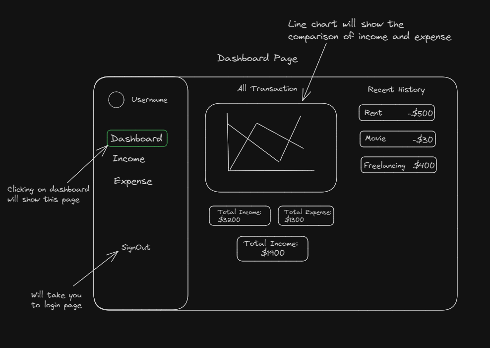

# Project Title
SpendSavvy

## Overview

SpendSavvy is a user-friendly application designed to help individuals track their income and expenses. It provides an intuitive interface for users to record, view, and manage their financial transactions, offering insights into their financial health through various visualizations and summaries.

### Problem

Managing personal finances can be challenging without a systematic approach. Many individuals struggle with tracking their income and expenses, leading to poor financial decisions and budgeting issues. Traditional methods like spreadsheets or manual logging are time-consuming and prone to errors. An efficient and automated expense tracking app addresses these pain points by providing a centralized platform for financial management.

### User Profile

- Primary Users: Individuals who want to manage their personal finances effectively.
- Secondary Users: Small business owners needing to track business expenses and income.
- Usage Context: Users will log in to the app to record their income and expenses, view financial summaries, and analyze their spending patterns. Special considerations include ensuring data security, ease of use, and mobile accessibility.

### Features

1. User Authentication: Users can register, log in, and manage their profiles securely.

2. Dashboard: A comprehensive overview including:
    - Line graph for income vs. expense comparison.
    - Total income value.
    - Total expense value.
    - Total balance value.
    - Recent transaction history.

3. Income Management:
    - Form to add new income (fields: name, amount, date, category, description).
    - Transaction history for income.
    - Ability to delete specific income entries.

4. Expense Management:
    - Form to add new expenses (fields: name, amount, date, category, description).
    - Transaction history for expenses.
    - Ability to delete specific expense entries.

5. Data Visualization: Graphical representation of financial data to help users understand their financial status at a glance.

## Implementation

### Tech Stack

- Frontend:
    - React
    - JavaScript
    - Chart.js (for line graph)

- Backend: 
    - Express

- Client libraries: 
    - react
    - react-router
    - axios

- Server libraries:
    - MongoDB
    - express
    - bcrypt for password hashing

### APIs

- No external APIs will be used for the first sprint

### Sitemap

- Login Page: User authentication.
- Registration Page: New user registration.
- Dashboard Page: Overview of financial data (graphs, summaries, recent transactions).
- Income Page: Form to add income, view and manage income transactions.
- Expense Page: Form to add expenses, view and manage expense transactions.

### Mockups

#### Login Page

#### Registration Page

#### Dasboard Page

#### Income Page

#### Expense Page

### Data

- user table

    - id Primary key, unique user ID
    - username	
    - email	
    - password	
    - created_at	

- Income table

    - id Primary key, unique income ID
    - user_id Foreign key, references Users.id
    - name	
    - amount	
    - date	
    - category	
    - description	
    - created_at	

- Expense table

    - id Primary key, unique expense ID
    - user_id Foreign key, references Users.id
    - name	
    - amount	
    - date	
    - category	
    - description	
    - created_at

### Data Visualization

- Chart.js will be used to create a line graph for income vs. expense comparison on the dashboard.

### Endpoints

- User Endpoints:
    - POST /api/register – Register a new user.
    - POST /api/login – Authenticate a user.

- Transaction Endpoints:
    - POST /api/income – Add new income.
    - GET /api/income – Get user income transactions.
    - DELETE /api/income/:id – Delete specific income.
    - POST /api/expense – Add new expense.
    - GET /api/expense – Get user expense transactions.
    - DELETE /api/expense/:id – Delete specific expense.

### Auth

- User authentication for the Expense Tracker app is implemented using MongoDB for data storage and JSON Web Tokens (JWT) for secure user sessions. 

## Roadmap

- Set up project repository and initialize project.
- Implement user authentication (registration and login).
- Design and develop the dashboard with summary data and line graph using Chart.js.
- Develop income page with form and transaction history.
- Develop expense page with form and transaction history.
- Implement deletion functionality for transactions.
- Integrate data visualization (line graphs).
- Perform testing and debugging.
- Finalize UI/UX design and polish the interface.

## Nice-to-haves

- Edit transaction functionality.
- Exporting transaction data to CSV or other formats.
