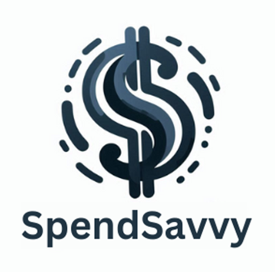
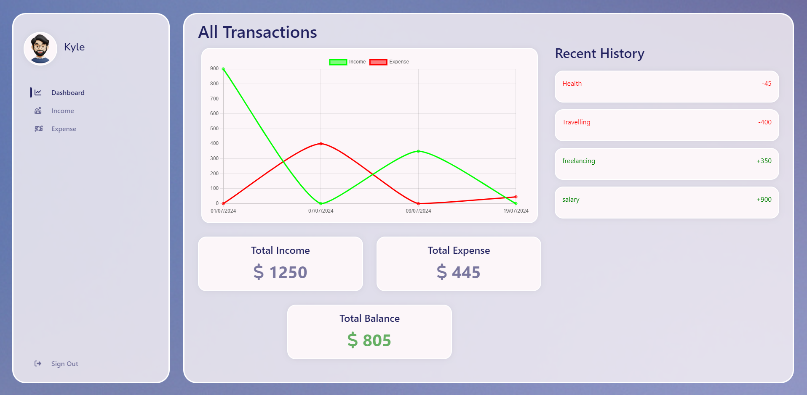

<!-- PROJECT LOGO -->
<br />
<div align="center">
  <a href="https://github.com/Dharati-Patel/Expense-Tracker">
    
  </a>

  <h3 align="center">SpendSavvy</h3>

  <p align="center">
    An intuitive expense tracking application to help you manage your finances!
    <br />
    <a href="https://github.com/Dharati-Patel/Expense-Tracker"><strong>Explore the docs »</strong></a>
    <br />
    <br />
    <a href="https://github.com/Dharati-Patel/Expense-Tracker">View Demo</a>
   
</div>

<!-- TABLE OF CONTENTS -->
<details>
  <summary>Table of Contents</summary>
  <ol>
    <li>
      <a href="#about-the-project">About The Project</a>
      <ul>
        <li><a href="#built-with">Built With</a></li>
      </ul>
    </li>
    <li>
      <a href="#getting-started">Getting Started</a>
      <ul>
        <li><a href="#prerequisites">Prerequisites</a></li>
        <li><a href="#installation">Installation</a></li>
      </ul>
    </li>
    <li><a href="#usage">Usage</a></li>
    <li><a href="#contributing">Contributing</a></li>
    <li><a href="#contact">Contact</a></li>
    <li><a href="#acknowledgments">Acknowledgments</a></li>
  </ol>
</details>

<!-- ABOUT THE PROJECT -->
## About The Project



SpendSavvy is a user-friendly application designed to help individuals track their income and expenses. It provides an intuitive interface for users to record, view, and manage their financial transactions, offering insights into their financial health through various visualizations and summaries.

### Problem

Managing personal finances can be challenging without a systematic approach. Many individuals struggle with tracking their income and expenses, leading to poor financial decisions and budgeting issues. Traditional methods like spreadsheets or manual logging are time-consuming and prone to errors. An efficient and automated expense tracking app addresses these pain points by providing a centralized platform for financial management.


<p align="right">(<a href="#readme-top">back to top</a>)</p>

### Built With

* React
* Node.js
* Express
* MongoDB
* Chart.js

<p align="right">(<a href="#readme-top">back to top</a>)</p>

<!-- GETTING STARTED -->
## Getting Started

### Prerequisites

### Installation

_Below is the instruction on how to get started._

1. Clone the repo
   ```sh
   git clone https://github.com/Dharati-Patel/Expense-Tracker.git
   ```
2. Create [MongoDB Database](https://www.mongodb.com/resources/languages/nodejs-database)
3. Set up Client Environment (.env file)
    ```sh
   VITE_API_URL=http://localhost:your_server_port/api
   ``` 
4. Set up Server Environment (.env file)
   ```sh
   PORT=port_number
   MONGO_URL=mongodb://database_connection_url
   ``` 
5. Navigate to Client Directory
   ```sh
   cd client
   ``` 
6. Install NPM packages
   ```sh
   npm install
   ```
7. Navigate to Server Directory
   ```sh
   cd server
   ``` 
8. Install NPM packages
   ```sh
   npm install
   ```
9. To run the application go to client and server folder and write
   ```sh
   npm run dev
   ```
10. Only responsive for desktop breakpoint 1280 px and more. 

<p align="right">(<a href="#readme-top">back to top</a>)</p>

## Responsive Design

The SpendSavvy web application is optimized for desktop screens with a viewport width of 1280 pixels or more.

### Usage

#### 1. Recording Transactions

Use SpendSavvy to effortlessly record your income and expenses. Simply navigate to the Income or Expense page, fill in the details, and click submit. Below is an example of adding a new expense:

1. Navigate to the Expense page.
2. Fill in the expense details: name, amount, date, category, and description.
3. Click 'Add Expense' to record the transaction.


#### 2. Viewing Financial Summaries

Utilize the Dashboard to gain insights into your financial health with summarized data and visualizations:

1. Visit the Dashboard to see an overview of your financial status.
2. View the line graph comparing your income versus expenses over time.
3. Check total income, total expenses, and your current balance at a glance.


#### 3. Managing Transactions

Efficiently manage your financial transactions with SpendSavvy's intuitive interface:

1. Use the transaction history on the Income and Expense pages to view past entries.
2. Delete specific transactions as needed for accurate financial tracking.

### Additional Resources

For more examples, please refer to the[Documentation](#) section of SpendSavvy.

<p align="right">(<a href="#readme-top">back to top</a>)</p>

## Contributing

Contributions are what make the open source community such an amazing place to learn, inspire, and create. Any contributions you make are greatly appreciated.

If you have a suggestion that would make SpendSavvy better, please follow these steps:

1. Fork the repository and create your feature branch (`git checkout -b feature/AmazingFeature`).
2. Commit your changes (`git commit -m 'Add some AmazingFeature'`).
3. Push to the branch (`git push origin feature/AmazingFeature`).
4. Open a pull request.

Alternatively, you can simply open an issue with the tag "enhancement" if you have ideas or suggestions for improvements.

Don't forget to give the project a star if you find it useful! Thanks for contributing to SpendSavvy!

<p align="right">(<a href="#readme-top">back to top</a>)</p>

<!-- CONTACT -->
## Contact

Dhaarti Patel - [LinkedIn](www.linkedin.com/in/dharti-patel1) 

Project Link: [https://github.com/Dharati-Patel/Expense-Tracker](https://github.com/Dharati-Patel/Expense-Tracker)

<p align="right">(<a href="#readme-top">back to top</a>)</p>

## Acknowledgments

I would like to acknowledge the following resources that have been instrumental in the development of SpendSavvy:

- [React](https://reactjs.org/) - A JavaScript library for building user interfaces.
- [Express](https://expressjs.com/) - Fast, unopinionated, minimalist web framework for Node.js.
- [MongoDB](https://www.mongodb.com/) - A general-purpose, document-based, distributed database.
- [Chart.js](https://www.chartjs.org/) - Simple yet flexible JavaScript charting for designers & developers.
- [dotenv](https://www.npmjs.com/package/dotenv) - A zero-dependency module that loads environment variables from a .env file into process.env.
- [Axios](https://axios-http.com/) - Promise-based HTTP client for the browser and Node.js.
- [SCSS](https://sass-lang.com/) - Syntactically Awesome Style Sheets, a CSS extension language.
- [Git](https://git-scm.com/) - Free and open-source distributed version control system.
- [GitHub](https://github.com/) - Platform for hosting and version control of software using Git.

These resources have provided essential functionalities, libraries, and tools that have significantly contributed to the development and functionality of SpendSavvy.

<p align="right">(<a href="#readme-top">back to top</a>)</p>